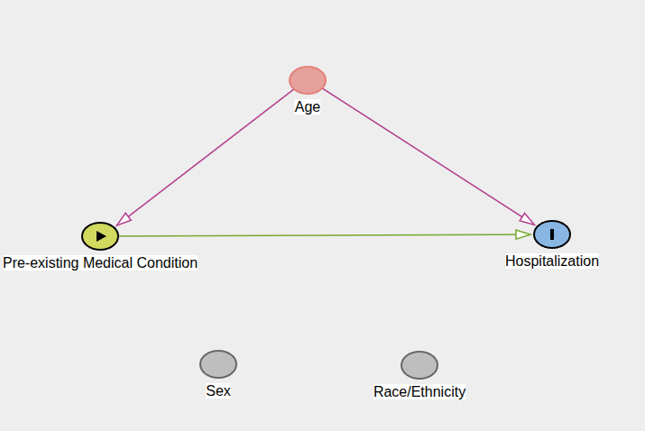
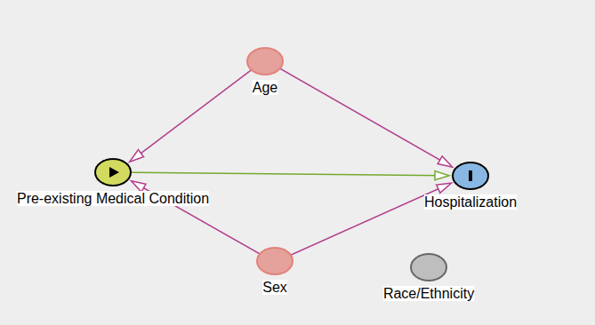

# First DAG

I believe Age is a confounder, and I don't have enough justification for specifying a causal relationship involving sex or race/ethnicity

### Relationship Paths

$E \to Y \qquad E \leftarrow Age \rightarrow Y$

* We can travel from medical condition backward into age and then forward into hospitalization!

Backdoor Path: a path between exposure and outcome that begins with an arrow pointing **into the exposure**

* Noncausal path connecting exposure and outcome

* Adjust for variables that block backdoor paths to isolate the relationship we're operating on

Our hypothesized causal structure contains an open backdoor path from medical condition to hospitalization through age, so age must be accounted for th block that path in the DAG

### Question to Think About

What is the smallest set of variables we could condition on to block every backdoor path between medical condition and hospitalization in the current DAG?

* If we condition on the set $S = \{A\}$ where $A = Age$, then we don't have any more backdoor paths or confounding variables for the current DAG

# Literature Review for DAG

## Age $\to$ COVID Hospitalization

What evidence supports age as an independent determinant of COVID-19 hospitalization/severe disease, such that age plausibly belongs upstream of our outcome?

**Romero Starke et al. (2021)**
* Evaluated isolated effect of age on severe COVID-19 outcomes while considering age-dependent comorbidities
* Hospitalization risk increased 3.4% per age year (ES=1.034, 95% CI 1.021 to 1.048)

**Moran et al. (2023)**
* Age was associated with COVID-19 hospitalization after multivariable adjustment: aOR 1.07 (95% CI 1.04–1.10) per one-year increase in age
    * $OR_{age}=1.07$: each additional year of age was associated with approximately 7\% higher odds of hospitalization in this study population, conditional on the other covariates in the model
* 14% of participants aged \(<50\) were hospitalized versus 42% of participants aged \(>50\)
* Age-adjusted comorbidity burden was associated with 30% increased odds of hospitalization [aOR 1.30(1.11-1.54)]
    * Useful for $Age \to Hospitalization$ and $Comorbidity \to Hospitalization | Age$

## Age $\to$ Pre-existing Medical Condition

CDC dataset doesn't identifiy a particular medical condition or count, just that that one was reportedalt text

* Does the prevalence of pre-existing medical conditions/comorbidity increase across age groups in adults?

**Ward and Black (2016)**
* Analyzed ~37k US adults $\geq 18$ from nationally representative NHIS
* Multiple Chronic Conditions (MCC) defined as $\geq$ 2 of 10 diagnosed chronic conditions
    * MCC prevalence increased with age: 18-44: 7.3%; 45-64: 32.1%; $\geq$ 65: 61.6%

**Schiøtz et al. (2017)**
* Study of ~1.4M people in Denmark with multimorbidity defined as $\geq2$ chronic conditions
    * prevalence varied strongly with age and nearly 50% of people 65 or older had multmobidity

# Sex Variable

Could sex plausibly create a noncausal path between our exposure and outcome that we would need to block?

## Sex $\to$ Hospitalization

**Gomez et al. (2021)**
* Retrospective cohort of 8,108 COVID-positive patients in Illinois
* Hospitalization occurred in 19% of males versus 13% of females (\(p<0.001\)).
* Authors report that male sex remained independently associated with hospitalization after adjustment for age and sum of comorbidities

**Pijls et al. (2022)**
* Meta-analysis of 229 studies including >10.4 million patients
* Among COVID-19-infected individuals, men had higher hospitalization risk than women: RR 1.33 (95% CI 1.27–1.41)
* Male sex was also associated with greater risk of severe disease, ICU admission, and death.
* REALLY IMPORTANT: Some sex differences changed over the study period

## Sex $\to$ Pre-existing Medical Condition

**Ward and Black (2016)**
* Analyzed ~37k US adults $\geq 18$ from nationally representative NHIS
* Multiple Chronic Conditions (MCC) defined as $\geq$ 2 of 10 diagnosed chronic conditions
    * MCC prevalence differed by sex: $P(MCC|Female)=27.2%$ and $P(MCC|Male)=24.1%$

# Second DAG

Condition on $S=\{Age, Sex\}$

## Race/Ethnicity $\to$ Hospitalization

Potential Causal Structure

**Doshi et al. (2017)**
* Reviewed >800 abstracts and cited 62 studies
* Reports persistent racial/ethnic disparities in preventable hospitalization
* Does not establish that race itself directly causes hospitalization

**Acosta et al. (2021)**
* Strong evidence of racial/ethnic disparities in COVID-19 hospitalization
* Racial/ethnic groups experienced disproportionate rates fo COVID-associated hospitalization

Race/ethnicity is treated as a proxy for potentially larger processes related to chronic disease and COVID-19 hospitalization, rather than a biological cause. The CDC dataset does not account for all of these processes that could generate the disparity data.

## Race/Ethnicity $\to$ Pre-existing Medical Condition

**Daw (2017)**
* American Indian and Black participants had significantly elevated rates of comorbidity compared with White participants; Asian/Pacific Islander participants often had significantly lower rates
* Models considered demographic, socioeconomic, behavioral, and neighborhood factors

# Third DAG

No reason to make a DAG_V3 because Race/Ethnicity may be too simplistic as a confounding variable on its own

* More likely to have an unknown confounding variable $U$ where $U$ represents some conbination of socioeconomic/societal circumstances, and adjusting for Race/Ethnicity won't actually block that path

Our DAG can be imperfect because our data is imperfect

# DAG Workflow

Causal Question $\to$ Plausible Causal Structure $\to$ Literature Search $\to$ Revise DAG

# Notes

A DAG describes the hypothesized data-generating process, not just columns present in the dataset

* Nodes can exist in the DAG even when we can't measure them
    * They shouldn't be removed because it's an identifiable limitation